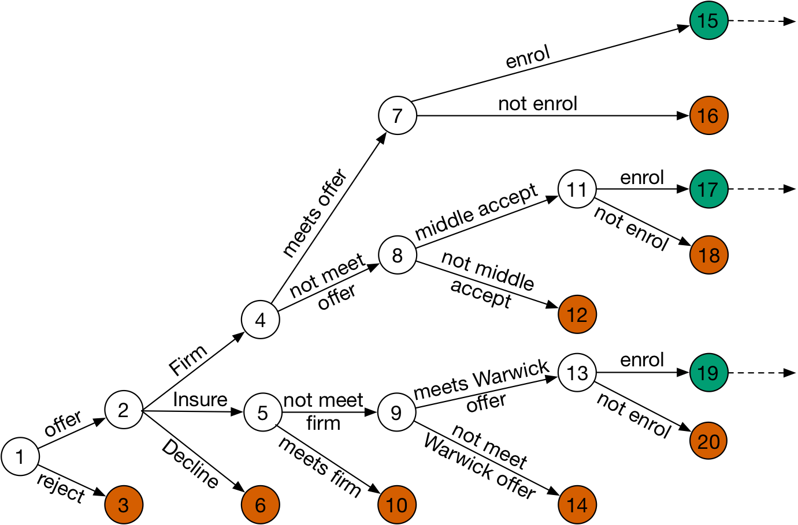

```{r setup, include=FALSE}
options(htmltools.dir.version = FALSE)
knitr::opts_chunk$set(echo = FALSE,
                      cache = TRUE)

library(ggplot2) 
theme_set(theme_bw(base_size=12))
theme_update(panel.background = element_rect(fill = "transparent", colour = NA),
             plot.background = element_rect(fill = "transparent", colour = NA),
             legend.key = element_rect(fill = "transparent", colour = NA),
             legend.background = element_rect(fill = "transparent", colour = NA))
knitr::opts_chunk$set(dev.args=list(bg="transparent"))
```

```{r xaringan-themer, include=FALSE}
library(xaringanthemer)
#mono_accent(
#  base_color = "#009E73",
#  code_font_family = "Fira Code",
#  code_font_url    = "https://cdn.rawgit.com/tonsky/FiraCode/1.204/distr/fira_code.css"
#)
solarized_light(
  code_font_family = "Fira Code",
  code_font_url    = "https://cdn.rawgit.com/tonsky/FiraCode/1.204/distr/fira_code.css")
```

```{r message = FALSE}
library(Admissions)
library(tidyverse)
library(DiagrammeR)
library(colorblindr)
library(EMK)
library(viridis)
library(xtable)
library(ordinal)
library(knitr)
```


class: inverse, center, middle

# The Admissions Process

---
class: centre, middle


```{r event-tree, fig.align = "center", fig.cap = "Event tree for the admissions process."}

```

---

# Aims

- Model the university admissions process
- Build a decision tool for the University of Warwick Statistics department to use during their admissions process

    - 'best' students
    - right number of them

--

## Some sub-questions    
- Who is likely to meet the offer (predicting A-level results)?
- Can we predict university performance from data available during the admissions period?

---

class: inverse, center, middle

# Data

---

### **5031** applicants for the 2011 - 2016 admissions cycles

--

### **1089** enrolled

--

### **1022** take first year exams


---

# What predictors?

--

- **Academic**

    - Further Mathematics result (where available)
    - Best 'other' A-level result
    - Whether they have a Physics/Chemisty A-level
    - Number of A-level results
    - Number of A\*/A grades at GCSE, for students with at least 8 GCSEs (imputed if missing)
--

- **Contextual**

    - School Type (State/Grammar/Independent)
    - POLAR3
    - Index of Multiple Deprivation (IMD)

--
    
- **Other**

    - Gender
    - Application period

---

class: inverse, center, middle


# Predicting A-levels

---

```{r}
all_preds <- FQ %>%
  filter(QUAL == "A-level") %>%
  filter(!is.na(PRED)) %>%
  select(STU_ID, SUBJ, PRED, Q_YEAR) %>%
  distinct()
```

```{r}
FQ_rslts <- FQ %>%
  filter(QUAL == "A-level") %>%
  filter(!is.na(RSLT)) %>%
  select(STU_ID, SUBJ, RSLT, Q_YEAR) %>%
  distinct()

QR_rslts <- QR %>%
  filter(QUAL == "A-level") %>%
  filter(!is.na(RSLT)) %>%
  separate("ACD_YEAR", c("y1", "Q_YEAR"), convert = TRUE) %>%
  select(-y1) %>%
  mutate(Q_YEAR = Q_YEAR + as.integer(2000)) %>%
  select(STU_ID, SUBJ, RSLT, Q_YEAR) %>%
  distinct()

all_results <- bind_rows(FQ_rslts, QR_rslts) %>%
  best_rslt(STU_ID, SUBJ, Q_YEAR) 
```

```{r}
p_and_r <- full_join(all_preds, all_results, by = c("STU_ID", "SUBJ", "Q_YEAR")) %>%
  select(STU_ID, SUBJ, PRED, RSLT, Q_YEAR) %>%
  distinct()

p_no_r <- p_and_r %>%
  filter(is.na(RSLT))

r_no_p <- p_and_r %>%
  filter(is.na(PRED)) 
```

```{r}
all_stu_all_subj_full <- Admissions::pred_vs_rslt(FQ, QR)
correct <- all_stu_all_subj_full$summary["correct"]*100
over_est <- all_stu_all_subj_full$summary["over_est"]*100
under_est <- all_stu_all_subj_full$summary["under_est"]*100
```

```{r}
all_stu_all_subj_df <- all_stu_all_subj_full$p_vs_r_df

all_num_qual <- all_stu_all_subj_df %>% nrow()
all_num_stu <- all_stu_all_subj_df %>% distinct(STU_ID) %>% nrow()
```

# Making matches

- Data are really messy
    - Different ways of counting A-levels; hundreds of inconsistencies
    - **`r nrow(r_no_p)`** results without predictions and **`r nrow(p_no_r)`** predictions without results

- Across all students and subjects, we can match **`r all_num_qual`** predicted grades and results, for **`r all_num_stu`** students.

---

class: center, middle

## Predicted grades are

.large[correct **`r correct`%** of the time] 

.large[over-estimated **`r over_est`%** of the time]

.large[under-estimated **`r under_est`%** of the time]  

---
# By subject

```{r pred-vs-rslt-fig-subj, fig.align="center", fig.width=10, fig.asp=0.618}

`%not_in%` <- purrr::negate(`%in%`)

all_stu_maths_full <- pred_vs_rslt(FQ, QR, SUBJ == "Mathematics")
all_stu_FM_full <- pred_vs_rslt(FQ, QR, SUBJ == "FM")
all_stu_non_maths_full <- pred_vs_rslt(FQ, QR, SUBJ %not_in% c("Mathematics", "FM", "FMA"))

all_stu_maths <- all_stu_maths_full$summary
all_stu_FM <- all_stu_FM_full$summary
all_stu_non_maths <- all_stu_non_maths_full$summary

filterings <- bind_rows(all_stu_maths, all_stu_FM, all_stu_non_maths)
filterings_names <- c("all students, maths", "all students, further maths", "all students, non-maths")
num_qual <- filterings %>% pull(num_qual)

filterings_names <- paste0(filterings_names, ", (n = ", num_qual, ")")

filterings_row_names <- data_frame(filtering = filterings_names)
df <- bind_cols(filterings_row_names, filterings) %>%
  arrange(-correct)

ordered_filterings <- df %>% pull(filtering)

df <- df %>%
  select(-num_qual, -num_stu) %>%
  gather(prediction, proportion, correct:under_est) %>%
  arrange(filtering) %>%
  mutate(filtering = factor(filtering, levels = ordered_filterings)) %>%
  mutate(prediction = factor(prediction, levels = c("under_est", "over_est", "correct"))) 

levels(df$filtering) <- gsub(",", "\n", levels(df$filtering))

df_all <- df %>%
  filter(filtering == "all students, all subjects")

g <- ggplot(df, aes(x = filtering, y = proportion, fill = prediction)) +
  geom_bar(stat = "identity") +
  #theme(axis.text.x = element_text(angle = -90, vjust = 0.5, hjust = 0), 
  #      legend.position = "top") + 
  theme(legend.position = "top") + 
  #ggtitle("Quality of Schools' A-level Predictions") +
  theme(axis.title.x = element_blank()) +
  scale_fill_OkabeIto(labels = c("under-estimated", "over-estimated", "correct"), order = c(4,2,3)) +
  # scale_alpha_manual(values = c("TRUE" = 1, "FALSE" = 0.7), guide = F) + 
  #theme_bw() +
  xlab("subset of students/qualifications") +
  scale_y_continuous(breaks = seq(0,1, 0.2), minor_breaks = seq(0,1,0.1)) +
  labs(fill="")

ggpres(g) 
```

---

# Can we do any better?

```{r}
MATHS_PRED <- FQ %>%
  filter(QUAL == "A-level") %>%
  filter(SUBJ == "Mathematics") %>%
  filter(!is.na(PRED)) %>%
  filter(PRED %in% c("A*", "A", "B", "C")) %>%
  select(STU_ID:ACD_YEAR, -RSLT) %>%
  most_recent(APP_CYCL, STU_ID) %>%
  distinct() %>%
  best_pred(STU_ID) %>%
  select(STU_ID, PRED) %>%
  rename(MATHS_PRED = PRED) %>%
  mutate(MATHS_PRED = if_else(MATHS_PRED != "A*", 0, 1)) 

MATHS_RSLT <- BEST_AL_RSLTS %>%
  filter(SUBJ == "Mathematics") %>%
  select(STU_ID, RSLT) %>%
  rename(MATHS_RSLT = RSLT) %>%
  mutate(MATHS_RSLT = if_else(MATHS_RSLT != "A*", 0, 1)) 

MATHS_PR <- left_join(MATHS_PRED, MATHS_RSLT, by = "STU_ID") %>%
  #left_join(MATHS_GCSE_RSLT, by = "STU_ID") %>%
  filter(!is.na(MATHS_RSLT)) # 90 of these

set.seed(1)
OUT_PRED_MATHS <- MATHS_PR %>%
  left_join(OUT_PRED, by = "STU_ID") %>%
  filter(!is.na(NUM_AL_RSLTS)) %>%
  filter(!is.na(SCL_TYPE_SIG)) %>% # NOTE: Missing school data needs tidying by hand. There is information on some of these schools that hasn't been joined properly. Those without UK schools should be removed from consideration. See no-scl chunk below
  filter(FEE_STAT == "H") %>%
  filter(!is.na(IMD_IQR)) %>%
  filter(!is.na(POLAR3)) %>%
  simputation::impute_en(AVG_GCSE ~ SCL_TYPE_SIG + FM_RSLT + BEST_OTHER_RSLT + NUM_AL_RSLTS) %>%
  simputation::impute_en(NUM_GCSE_AstarA ~ SCL_TYPE_SIG + FM_RSLT + BEST_OTHER_RSLT + NUM_AL_RSLTS) #%>%
#  simputation::impute_en(MATHS_GCSE_RSLT ~ SCL_TYPE_SIG + FM_RSLT + BEST_OTHER_RSLT + NUM_AL_RSLTS) %>%
#  mutate(MATHS_GCSE_RSLT = if_else(MATHS_GCSE_RSLT > 0.5, 1, 0))
```

```{r}
set.seed(1)
train <- OUT_PRED_MATHS %>% sample_frac(0.8)
test <- OUT_PRED_MATHS %>% anti_join(train, by = c("STU_ID", "MATHS_PRED", "MATHS_RSLT", "NON_ENGAGER", "PROCEED", "GOOD_PASS", "YEAR_MARK", "CLASSIFICATION", "RESITS", "GENDER", "POLAR3", "FEE_STAT", "SCL_TYPE_SI", "SCL_TYPE_SIG", "SCL_TYPE_SI6", "SCL_TYPE_SIG6", "IMD_5", "IMD_4", "IMD_3", "IMD_IQR", "FM_RSLT", "SUBJ_GROUP1", "SUBJ_GROUP", "FM_RSLT_FULL", "BEST_OTHER_RSLT", "BEST_OTHER_RSLT_FULL", "HAS_SCIENCE", "HAS_PHYS_CHEM", "NUM_AL_RSLTS", "AVG_GCSE", "NUM_GCSE", "NUM_GCSE_AstarA", "NUM_GCSE_Astar", "PCT_GCSE_AstarA", "PCT_GCSE_Astar", "MA", "APP_PERIOD", "APP_DATE", "APP_CYCL"))
```

```{r}
mod1_train <- glm(MATHS_RSLT ~ MATHS_PRED, family = "binomial", data = train)
mod2_train <- glm(MATHS_RSLT ~ MATHS_PRED + SCL_TYPE_SIG + AVG_GCSE + NUM_AL_RSLTS + HAS_PHYS_CHEM + APP_PERIOD + GENDER, family = "binomial", data = train)
```

```{r eval = FALSE}
anova(mod1_train, mod2_train, test = "Chisq")

logLik(mod1_train) #  -589.8274 (df=2)
logLik(mod2_train) # -531.9708 (df=12)
AIC(mod1_train) # 1183.655
AIC(mod2_train) # 1087.942
```

```{r}
PRED <- test$MATHS_PRED
PRED1 <- ifelse(predict(mod1_train, type = "response", newdata = test) >= 0.5, 1, 0)
PRED2 <- ifelse(predict(mod2_train, type = "response", newdata = test) >= 0.5, 1, 0)

OBS <- test$MATHS_RSLT

tab1 <- table(OBS, PRED1)
tab2 <- table(OBS, PRED2)
tab <- table(OBS, PRED = test$MATHS_PRED) # same as tab1
```

```{r}
TN1 = tab1[1,1]
FN1 = tab1[2,1]
FP1 = tab1[1,2]
TP1 = tab1[2,2]

accuracy1 = (TP1 + TN1) / nrow(test)
sensitivity1 = TP1 / (TP1 + FN1)
specificity1 = TN1 / (TN1 + FP1)
```

```{r}
TN2 = tab2[1,1]
FN2 = tab2[2,1]
FP2 = tab2[1,2]
TP2 = tab2[2,2]

accuracy2 = (TP2 + TN2) / nrow(test)
sensitivity2 = TP2 / (TP2 + FN2)
specificity2 = TN2 / (TN2 + FP2)
```

```{r}
TN = tab[1,1]
FN = tab[2,1]
FP = tab[1,2]
TP = tab[2,2]

accuracy = (TP + TN) / nrow(test)
sensitivity = TP / (TP + FN)
specificity = TN / (TN + FP)
```

- Home students (those with home postcodes in England), who are taking at least 3 A-levels at a UK school (GCSE covariates imputed where necessary) **`r nrow(OUT_PRED_MATHS)`** of these.

- Train on 80% on data, test on 20%.

- Fit two logistic regression models for predicting A-level Mathematics result (A\* or lower):
    - First with predicted grade as only covariate
    - Second with predicted grade plus school type, average GCSE score, number of A-levels, whether they're taking Physics/Chemistry A-level, Gender and Application period.

---
# Can we do any better?

- Second model is a significantly better fit to the data on the training set.
- Teachers'/first model accuracy on test set is **`r scales::percent(accuracy)`**.
- Accuracy on test set for second model is **`r scales::percent(accuracy2)`**.

--
```{r}
FM_PRED <- FQ %>%
  filter(QUAL == "A-level") %>%
  filter(SUBJ == "FM") %>%
  filter(!is.na(PRED)) %>%
  filter(PRED %in% c("A*", "A", "B", "C")) %>%
  select(STU_ID:ACD_YEAR, -RSLT) %>%
  most_recent(APP_CYCL, STU_ID) %>%
  distinct() %>%
  best_pred(STU_ID) %>%
  select(STU_ID, PRED) %>%
  rename(FM_PRED = PRED) %>%
  mutate(FM_PRED = if_else(FM_PRED %not_in% c("A*", "A"), 0, 1)) 

FM_RSLT <- BEST_AL_RSLTS %>%
  filter(SUBJ == "FM") %>%
  select(STU_ID, RSLT) %>%
  rename(FM_RSLT_bin = RSLT) %>%
  mutate(FM_RSLT_bin = if_else(FM_RSLT_bin %not_in% c("A*", "A"), 0, 1)) 

FM_PR <- left_join(FM_PRED, FM_RSLT, by = "STU_ID") %>%
  #left_join(MATHS_GCSE_RSLT, by = "STU_ID") %>%
  filter(!is.na(FM_RSLT_bin)) 

set.seed(1)
OUT_PRED_FM <- FM_PR %>%
  left_join(OUT_PRED, by = "STU_ID") %>%
  filter(!is.na(NUM_AL_RSLTS)) %>%
  filter(!is.na(SCL_TYPE_SIG)) %>% # NOTE: Missing school data needs tidying by hand. There is information on some of these schools that hasn't been joined properly. Those without UK schools should be removed from consideration. See no-scl chunk below
  filter(FEE_STAT == "H") %>%
  filter(!is.na(IMD_IQR)) %>%
  filter(!is.na(POLAR3)) %>%
  simputation::impute_en(AVG_GCSE ~ SCL_TYPE_SIG + FM_RSLT + BEST_OTHER_RSLT + NUM_AL_RSLTS) %>%
  simputation::impute_en(NUM_GCSE_AstarA ~ SCL_TYPE_SIG + FM_RSLT + BEST_OTHER_RSLT + NUM_AL_RSLTS) %>%
  rename(FM_PRED = FM_PRED.y)
#  simputation::impute_en(MATHS_GCSE_RSLT ~ SCL_TYPE_SIG + FM_RSLT + BEST_OTHER_RSLT + NUM_AL_RSLTS) %>%
#  mutate(MATHS_GCSE_RSLT = if_else(MATHS_GCSE_RSLT > 0.5, 1, 0))
```

```{r}
set.seed(1)
train <- OUT_PRED_FM %>% sample_frac(0.8)
test <- OUT_PRED_FM %>% anti_join(train, by = c("STU_ID", "FM_PRED", "FM_RSLT", "NON_ENGAGER", "PROCEED", "GOOD_PASS", "YEAR_MARK", "CLASSIFICATION", "RESITS", "GENDER", "POLAR3", "FEE_STAT", "SCL_TYPE_SI", "SCL_TYPE_SIG", "SCL_TYPE_SI6", "SCL_TYPE_SIG6", "IMD_5", "IMD_4", "IMD_3", "IMD_IQR", "FM_RSLT", "SUBJ_GROUP1", "SUBJ_GROUP", "FM_RSLT_FULL", "BEST_OTHER_RSLT", "BEST_OTHER_RSLT_FULL", "HAS_SCIENCE", "HAS_PHYS_CHEM", "NUM_AL_RSLTS", "AVG_GCSE", "NUM_GCSE", "NUM_GCSE_AstarA", "NUM_GCSE_Astar", "PCT_GCSE_AstarA", "PCT_GCSE_Astar", "MA", "APP_PERIOD", "APP_DATE", "APP_CYCL"))
```

```{r}
mod1_train <- glm(FM_RSLT_bin ~ FM_PRED, family = "binomial", data = train)
mod2_train <- glm(FM_RSLT_bin ~ FM_PRED + SCL_TYPE_SIG + AVG_GCSE + NUM_AL_RSLTS + HAS_PHYS_CHEM + APP_PERIOD + GENDER, family = "binomial", data = train)
```

```{r eval = FALSE}
anova(mod1_train, mod2_train, test = "Chisq")

logLik(mod1_train) #  -589.8274 (df=2)
logLik(mod2_train) # -531.9708 (df=12)
AIC(mod1_train) # 1183.655
AIC(mod2_train) # 1087.942
```

```{r}
PRED <- test$FM_PRED
PRED1 <- ifelse(predict(mod1_train, type = "response", newdata = test) >= 0.5, 1, 0)
PRED2 <- ifelse(predict(mod2_train, type = "response", newdata = test) >= 0.5, 1, 0)

OBS <- test$FM_RSLT_bin

tab1 <- table(OBS, PRED1)
tab2 <- table(OBS, PRED2)
tab <- table(OBS, PRED = test$FM_PRED) 
```

```{r}
TN1 = tab1[1,1]
FN1 = tab1[2,1]
FP1 = tab1[1,2]
TP1 = tab1[2,2]

accuracy1 = (TP1 + TN1) / nrow(test)
sensitivity1 = TP1 / (TP1 + FN1)
specificity1 = TN1 / (TN1 + FP1)
```

```{r}
TN2 = tab2[1,1]
FN2 = tab2[2,1]
FP2 = tab2[1,2]
TP2 = tab2[2,2]

accuracy2 = (TP2 + TN2) / nrow(test)
sensitivity2 = TP2 / (TP2 + FN2)
specificity2 = TN2 / (TN2 + FP2)
```

```{r}
TN = tab[1,1]
FN = tab[2,1]
FP = tab[1,2]
TP = tab[2,2]

accuracy = (TP + TN) / nrow(test)
sensitivity = TP / (TP + FN)
specificity = TN / (TN + FP)
```


- Repeating for predicting A\*/A at Further Maths, second model is a better fit on the training data, but not much in it on the test data (**`r scales::percent(accuracy1)`** vs **`r scales::percent(accuracy2)`**).
---

class: inverse, center, middle


# Predicting university outcomes

---

```{r}
OUT_PRED_UK <- OUT_PRED %>%
  filter(STU_ID %in% MM_BY_STU$STU_ID) %>%
  #mutate(PROCEED = fct_relevel("not_proceed", "proceed")) %>%
  filter(!is.na(NUM_AL_RSLTS)) %>%
  filter(!is.na(SCL_TYPE_SIG)) %>% # NOTE: Missing school data needs tidying by hand. There is information on some of these schools that hasn't been joined properly. Those without UK schools should be removed from consideration. See no-scl chunk below
  filter(FEE_STAT == "H")

OUT_PRED_data <- OUT_PRED_UK %>%
  filter(!is.na(IMD_IQR)) %>%
  filter(!is.na(POLAR3)) %>%
  simputation::impute_en(AVG_GCSE ~ SCL_TYPE_SIG + FM_RSLT + BEST_OTHER_RSLT + NUM_AL_RSLTS) %>%
  simputation::impute_en(NUM_GCSE_AstarA ~ SCL_TYPE_SIG + FM_RSLT + BEST_OTHER_RSLT + NUM_AL_RSLTS)# %>%
  #dplyr::select(NON_ENGAGER:POLAR3, SCL_TYPE_SIG, IMD_IQR, FM_RSLT, BEST_OTHER_RSLT, HAS_PHYS_CHEM + NUM_AL_RSLTS, AVG_GCSE, APP_PERIOD)

#OUT_PRED_data_proceed <- OUT_PRED_data %>%
#  dplyr::select(PROCEED, GENDER:APP_PERIOD)
```

# What outcomes?

- Drop-out / non-engagement (binary)
- Proceeding to the second year (binary)
- Resits required (binary)
- Good pass (binary)
- Classification (ordered categories)
- Year mark (percentage)

---

# Which students (for now)?
- Home students (those with home postcodes in England), who are taking at least 3 A-levels at a UK school, who have achieved at least some marks towards at least some modules. There are **`r nrow(OUT_PRED_data)`** of these.

    - We do not know how well students who were not admitted to Warwick would have done had they had the opportunity.

<!-- --- -->

<!-- # Further Mathematics A-level -->

```{r FM-ecdf-all, fig.cap = "ECDF of first year marks by Further Mathematics A-level grade, amongst all students", fig.align = "center", warning = FALSE, eval = FALSE}
tmp <- MM_BY_STU %>%
  most_recent(EXAM_YEAR, STU_ID) %>% 
  most_recent(ATTEMPT, STU_ID) %>%
  dplyr::select(STU_ID, YEAR_MARK) %>%
  left_join(BEST_AL_RSLTS_wide, by = "STU_ID") %>%
  select(STU_ID, FM, YEAR_MARK) %>%
  filter(!is.na(FM)) %>%
  filter(FM %in% c("A", "A*", "B")) %>%
  mutate(FM = factor(FM, levels = c("A*", "A", "B")))

g <- ggplot(tmp, aes(YEAR_MARK, colour = FM)) +
  stat_ecdf(size = 1.5) +
  scale_color_OkabeIto() +
  theme_bw() +
  xlab("First year overall percentage")

ggpres(g)

```

<!-- --- -->
```{r eval = FALSE}
cv_fit <- OUT_PRED_data %>%
  twidlr::cv.glmnet(PROCEED ~ FM_RSLT + BEST_OTHER_RSLT + HAS_PHYS_CHEM + NUM_AL_RSLTS + NUM_GCSE_AstarA + SCL_TYPE_SIG + POLAR3 + IMD_IQR + GENDER + APP_PERIOD, family = "binomial") 

opt_lambda <- cv_fit$lambda.min

lasso_fit <- cv_fit$glmnet.fit

# coef(lasso_fit, s = opt_lambda)

FM_RSLT_or <- round(exp(coef(lasso_fit, s = opt_lambda)["FM_RSLTA_or_lower",1]),1)  
AVG_GCSE_or <- round(1/exp(coef(lasso_fit, s = opt_lambda)["AVG_GCSE",1]),1)

```


<!-- # Proceed to second year -->

```{r}
tmp <- OUT_PRED_data %>%
  count(PROCEED) %>%
  pull(n)


OUT_PRED_data <- OUT_PRED_data %>%
    mutate(PROCEED = fct_relevel(PROCEED, "not_proceed"))

fit <- glm(PROCEED ~ FM_RSLT + BEST_OTHER_RSLT + HAS_PHYS_CHEM + NUM_AL_RSLTS + NUM_GCSE_AstarA + SCL_TYPE_SIG + POLAR3 + IMD_IQR + GENDER + APP_PERIOD, data = OUT_PRED_data, family = "binomial")

hpc_odds <- summary(fit)$coef[,1]["HAS_PHYS_CHEMTRUE"] %>% unname() %>% exp() %>% round(1)

FM_Alow_or <- round(1/exp(summary(fit)$coef[,1]["FM_RSLTA_or_lower"]),1)

#summary(fit)
```

```{r eval = FALSE}

PRED <- ifelse(predict(fit, type = "response") >= 0.5, "proceed", "not_proceed")
tab <- table(OBS = OUT_PRED_data$PROCEED, PRED)

```

<!-- - `r tmp[2]` proceed to 2nd year. `r tmp[1]` do not. -->
<!-- - Fit a logistic regression model. -->
<!-- - The only coefficients significant at 5% relate to A-level results:  -->
<!--     - Having an A or lower in Further Maths A-level decreases the odds of proceeding by `r FM_Alow_or` relative to having an A\*. -->
<!--     - The odds of proceeding is `r hpc_odds` times higher for those with Physics/Chemistry A-level than those without. Seems curiously high. -->
<!-- - Fitted data: predicts everyone proceeds -->
<!-- - LASSO: Only non-zero coefficients are the intercept and two significant ones above, both in same direction as logistic regression model, but smaller effect. -->

```{r eval = FALSE}
cv_fit <- OUT_PRED_data %>%
  twidlr::cv.glmnet(PROCEED ~ FM_RSLT + BEST_OTHER_RSLT + HAS_PHYS_CHEM + NUM_AL_RSLTS + NUM_GCSE_AstarA + SCL_TYPE_SIG + POLAR3 + IMD_IQR + GENDER + APP_PERIOD, family = "binomial") 

opt_lambda <- cv_fit$lambda.min

lasso_fit <- cv_fit$glmnet.fit

coef(lasso_fit, s = opt_lambda)

FM_RSLT_or <- round(exp(coef(lasso_fit, s = opt_lambda)["FM_RSLTA_or_lower",1]),1)  
HPC_or <- round(1/exp(coef(lasso_fit, s = opt_lambda)["HAS_PHYS_CHEMTRUE",1]),1)
```    
    
```{r}
tmp <- OUT_PRED_data %>%
  count(PROCEED) %>%
  mutate(percent = n/sum(n)) %>%
  pull(percent)

percent_not_proceed <- round(tmp[1] *100,1)
#scales::percent(tmp[1])
```

<!-- -- -->

<!-- - Further considerations -->
<!--     - When splitting into training and validation sets, start getting perfect separation of variables. Use bias-reduced GLMs instead? -->
<!--     - Is not proceeding a rare event? Only `r percent_not_proceed`% of this group do not progress. Use rare event logistic regression instead? -->

```{r lm}
lmod1 <- lm(YEAR_MARK ~ FM_RSLT + BEST_OTHER_RSLT + HAS_PHYS_CHEM + NUM_AL_RSLTS + NUM_GCSE_AstarA + SCL_TYPE_SIG + POLAR3 + IMD_IQR + GENDER + APP_PERIOD, data = OUT_PRED_data)

# summary(lmod1)

# summary(lmod1)
#tab1 <- xtable(summary(lmod1), label="tab:proceed-mod1-summary", caption = "Summary of a linear regression model or failing to proceed, with covariates gender (reference level female), POLAR3 (reference level quintile 1), school type (reference level State), IMD (reference level low), Further Mathematics A-level result (reference level A*), best other A-level result (reference level A*), Number of A-levels (reference level 3), average GCSE score, application period (reference level early)") 
#print(tab1, type = "html", comment = FALSE, caption.placement = "top")  
```

<!-- - Linear regression  -->
<!--     - FM result, best other A-level result and mean GCSE result all highly significant, in expected direction -->
<!--     - Having four A-levels (as opposed to three) also beneficial, as is applying early. -->
<!--     - That said, model is probably over-fitted and, looking at residuals, doesn't appear to be a very good fit. -->

---

# First year degree classification

```{r message = FALSE, warning = FALSE, include = FALSE}
class_clm <- clm(CLASSIFICATION ~ FM_RSLT + BEST_OTHER_RSLT + HAS_PHYS_CHEM + NUM_AL_RSLTS + NUM_GCSE_AstarA + SCL_TYPE_SIG + POLAR3 + IMD_IQR + GENDER + APP_PERIOD, data = OUT_PRED_data, trace = 0)

class_mlm <- nnet::multinom(CLASSIFICATION ~ FM_RSLT + BEST_OTHER_RSLT + HAS_PHYS_CHEM + NUM_AL_RSLTS + NUM_GCSE_AstarA + SCL_TYPE_SIG + POLAR3 + IMD_IQR + GENDER + APP_PERIOD, data = OUT_PRED_data)

clm_ll <- logLik(class_clm) #-597.8464 (df=24)
mlm_ll <- logLik(class_mlm) # -565.8016 (df=84)

# degrees of freedom for test = 84 - 24 =60 (?)
G <- -2 * (clm_ll[1] - mlm_ll[1])
p <- pchisq(G, 84-24, lower.tail = FALSE)

summary(class_clm)

male_odds <- class_clm$beta["GENDERM"] %>% unname() %>% exp() %>% round(1)

late_app_odds <- class_clm$beta["APP_PERIODlate"] %>% unname() %>% exp()
late_app_odds <- round(1/late_app_odds, 1)
```

- Proportional odds logistic regression model

- Covariates significant at 5%:

```{r}
rownames <- coef(summary(class_clm)) %>% rownames()

CI <- exp(confint(class_clm)) %>%
  as_data_frame() %>%
  mutate(Variable = rownames[5:24]) %>%
  mutate(`2.5 %` = round(`2.5 %`, 2), `97.5 %` = round(`97.5 %`, 2))

variable <- c("FM (A or lower) - relative to A*", "FM (no result) - relative to A*", "Best other A-level (A) - relative to A*", "Best other A-level (lower) - relative to A*", "Has Physics/Chemistry A-level", "Num A*/A at GCSE", "Male", "Late application - relative to early")

coef(summary(class_clm)) %>%
  as_data_frame() %>%
  mutate(Variable = rownames) %>%
  select(Variable, Estimate:`Pr(>|z|)`) %>%
  dplyr::slice(-(1:4)) %>%
  filter(`Pr(>|z|)` < 0.05) %>%
  mutate(OR = round(exp(Estimate), 2)) %>%
  select(Variable, OR) %>%
  left_join(CI, by = "Variable") %>% 
  select(-Variable) %>%
  mutate(Variable = variable) %>%
  select(Variable, OR, `2.5 %`, `97.5 %`) %>%
  knitr::kable(format = "html")
```

???

For any fixed classification level, the estimated odds that a male is in the higher direction is is 1.54 the estimated odds for a female.

---

# Considerations
- Why are contextual factors that have found to be significant in the literature not significant here?

- What about likely important factors that we do not have in the admissions data (e.g. personality traits, study habits, what happens once they are at university)?

---
class: center, middle

# Thank you!
## What questions do you have for me?


## I'd love to hear from you!
[E.Kaye.1@warwick.ac.uk](mailto:E.Kaye.1@warwick.ac.uk)

[@ellamkaye](https://twitter.com/ellamkaye)

[ellakaye.rbind.io](https://ellakaye.rbind.io)

[github.com/EllaKaye](https://github.com/ellakaye)

